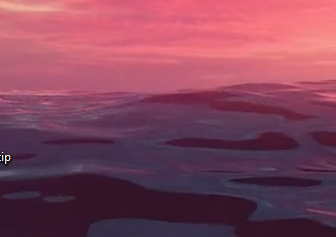

zdanie to jest

**siema**

*ukośne*

***ukośne i pogrubione***

# Nagłówek

fajnie

## mniejszy nagłowek

### jeszcze mniejszy

kjgnfkjgebweggkj ewgwegkjewbgewg weg weg weg ewg weg e
enwfkjnekjnewfwefwefmef
ewfwefwefbnwefjbe
dnjawkj
gdzieśtam daej

- jeden
- dawa 
    - siema podpunkt jestem

1. cośtam
1. w środek
1. coś innego
    1. tak

[to jest yt](www.youtube.com)

# Nagłówek 2 

odgraniczenie 

---

jej

|tab1 |tab2 |tab3 |
|-----|-----|-----|
|cośt |lala |nie  |

